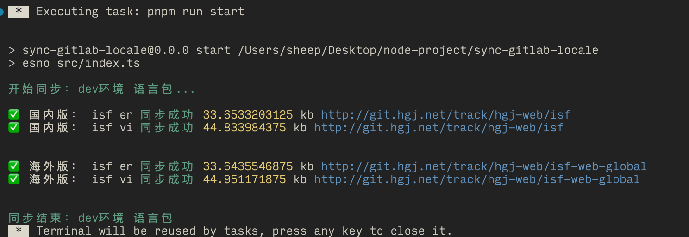

# 语言包同步脚本

该 Node.js 脚本旨在在本地和远程 GitLab 仓库之间同步语言包，适用于国内和海外环境。脚本从指定的 GitLab 仓库获取语言文件，并将其更新到相应的 API 端点。

## 目录

- [安装](#安装)
- [使用方法](#使用方法)
- [配置](#配置)
- [工作原理](#工作原理)
- [错误处理](#错误处理)
- [依赖项](#依赖项)

## 安装

1. **克隆仓库：**

   ```bash
   git clone <仓库地址>
   cd <仓库目录>
   ```

2. **安装依赖项：**

   ```bash
   npm install
   ```

3. **设置环境变量：**

   确保你已经在环境中设置了 GitLab 的 token：

   ```bash
   export GITLAB_TOKEN=<your-gitlab-token>
   ```

## 使用方法

要执行脚本，运行以下命令：

```bash
node sync-locale.js
```

脚本将根据提供的配置同步语言包。

## 配置

脚本使用一个配置文件[config](./src/config.ts)来定义需要同步的项目和语言包。以下是配置选项的简要说明：

- **env**：环境（例如，`dev`、`prod`）。
- **managerSessionId**：国内环境 beta 的 token。
- **globalManagerSessionId**：海外环境 beta 的 token。
- **prodManagerSessionId**：国内环境生产环境的 token。
- **prodGlobalManagerSessionId**：海外环境生产环境的 token。
- **include**：需要同步的国内项目列表（默认是全部）。
- **includeGlobal**：需要同步的全球项目列表（默认是全部）。
- **branch**：默认要同步的分支。
- **locale**：默认要同步的语言包文件。
- **project**：项目列表，包括项目 ID、名称、URL 及其他详细信息。

配置示例：

```typescript
const config: Config = {
  env: Env.DEV,
  managerSessionId: '<beta_token>',
  globalManagerSessionId: '<beta_global_token>',
  prodManagerSessionId: '<prod_token>',
  prodGlobalManagerSessionId: '<prod_global_token>',
  branch: 'main',
  include: [Item.ISF],
  includeGlobal: [Item.ACI],
  locale: [
    { lang: 'en', path: 'src/plugins/vue-i18n/lang/en.json' },
    { lang: 'vi', path: 'src/plugins/vue-i18n/lang/vi.json' },
  ],
  project: [
    { id: 1019, name: Item.ISF, url: '<project_url>', isGlobal: false },
    // 其他项目...
  ],
}
```

## 工作原理

1. **项目筛选**：脚本根据 `include` 和 `includeGlobal` 数组筛选需要同步的项目。

2. **获取远程文件**：根据项目配置从 GitLab 仓库中获取语言文件。

3. **同步到远程 API**：将获取的语言文件发送到相应的国内或海外 API 端点。

4. **日志记录**：脚本为每个同步过程提供成功或失败的消息。

## 错误处理

- 如果脚本遇到 `GitbeakerRequestError` 错误，它会记录导致问题的项目、分支和文件路径的错误信息。
- 如果会话 token 无效或已过期，脚本将记录错误消息并退出。

## 依赖项

- **[@gitbeaker/rest](https://www.npmjs.com/package/@gitbeaker/rest)**：GitLab API 客户端。
- **[chalk](https://www.npmjs.com/package/chalk)**：终端字符串样式。
- **[node:buffer](https://nodejs.org/api/buffer.html)**：Node.js Buffer 模块。
- **[node:process](https://nodejs.org/api/process.html)**：Node.js Process 模块。

通过 npm 安装依赖项：

```bash
npm install @gitbeaker/rest chalk
```

## 示例


